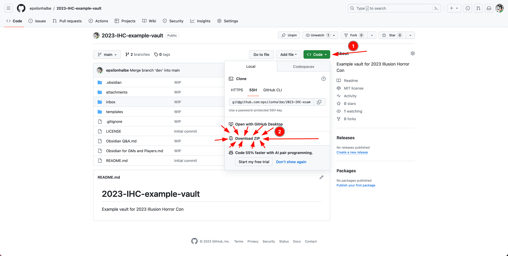

# 2023-IHC-example-vault
Example vault for 2023 Illusion Horror Con

Please then go to "Settings" -> "Community Plugins" -> Browse -> Search for "Advanced Slides" and install the plugin, then you can go to [[Obsidian for GMs and Players]], open the command palette (Cmd/Ctrl+P by default) and search for "Advanced Slides: Show Slides preview" and you can go through the presentation.